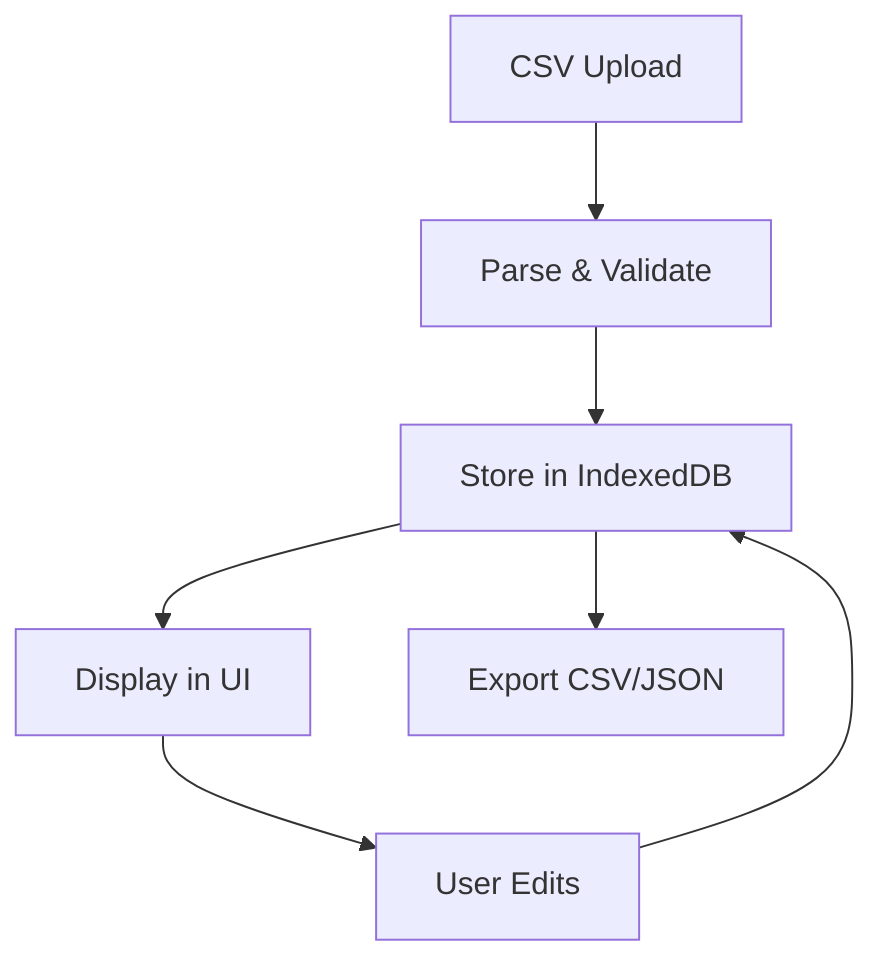
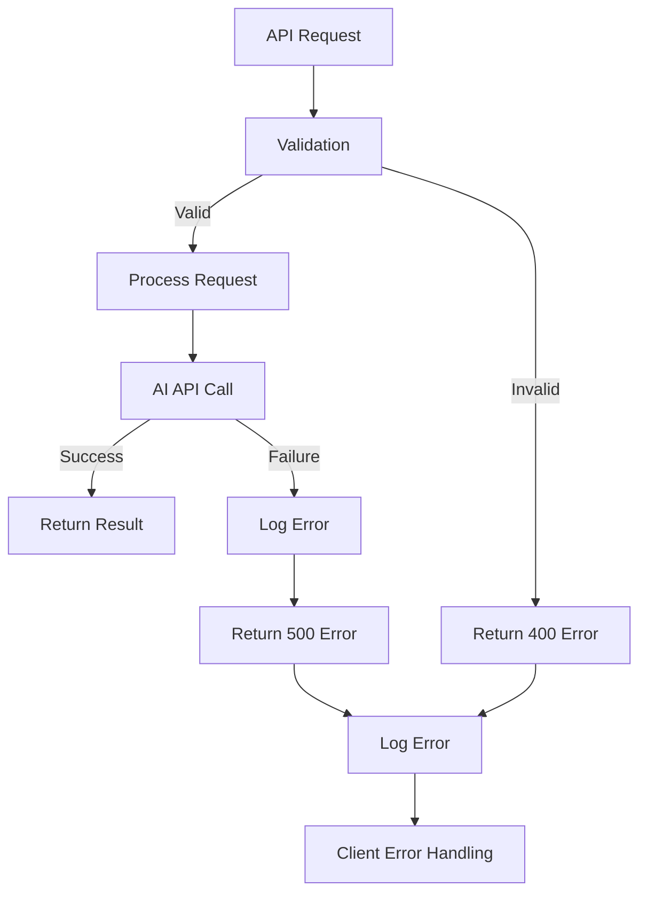

# MVV抽出システム アーキテクチャ文書

## システム概要

AI技術を活用して日本のヘルスケア企業30社のMission（使命）、Vision（理念）、Values（価値観）を自動抽出するWebアプリケーションシステム。

## アーキテクチャ概要

```
┌─────────────────────────────────────────────────────────────────────────┐
│                           Frontend (React)                             │
│  ┌─────────────────┐ ┌─────────────────┐ ┌─────────────────┐          │
│  │  Company Mgmt   │ │  MVV Extractor  │ │ Results Viewer  │          │
│  │                 │ │                 │ │                 │          │
│  │ • CSV Import    │ │ • Batch Process │ │ • Table View    │          │
│  │ • CRUD Ops      │ │ • Progress UI   │ │ • Export CSV    │          │
│  │ • Status Track  │ │ • AI Selection  │ │ • Manual Edit   │          │
│  └─────────────────┘ └─────────────────┘ └─────────────────┘          │
│                                   │                                     │
│  ┌─────────────────┐ ┌─────────────────┐ ┌─────────────────┐          │
│  │   State Mgmt    │ │   Local Store   │ │   API Client    │          │
│  │    (Zustand)    │ │   (IndexedDB)   │ │  (Axios/Fetch)  │          │
│  └─────────────────┘ └─────────────────┘ └─────────────────┘          │
└─────────────────────────────────────────────────────────────────────────┘
                                   │ HTTPS API Calls
                                   ▼
┌─────────────────────────────────────────────────────────────────────────┐
│                         Backend (Netlify Functions)                    │
│                                                                         │
│  ┌─────────────────┐ ┌─────────────────┐ ┌─────────────────┐          │
│  │  extract-mvv.js │ │extract-mvv-     │ │   health.js     │          │
│  │   (OpenAI)      │ │perplexity.js    │ │  (Health Check) │          │
│  │                 │ │  (Perplexity)   │ │                 │          │
│  │ • GPT-4o Model  │ │ • sonar-pro     │ │ • Status Check  │          │
│  │ • 3-8s process  │ │ • Web Search    │ │ • Uptime Mon    │          │
│  │ • High accuracy │ │ • 8-15s process │ │                 │          │
│  └─────────────────┘ └─────────────────┘ └─────────────────┘          │
│                                   │                                     │
│  ┌─────────────────┐ ┌─────────────────┐ ┌─────────────────┐          │
│  │     CORS        │ │   Rate Limit    │ │   Auth & Log    │          │
│  │   Protection    │ │  100 req/15min  │ │  API Key + Log  │          │
│  └─────────────────┘ └─────────────────┘ └─────────────────┘          │
└─────────────────────────────────────────────────────────────────────────┘
                                   │ API Calls
                                   ▼
┌─────────────────────────────────────────────────────────────────────────┐
│                        External AI Services                            │
│                                                                         │
│  ┌─────────────────┐              ┌─────────────────┐                  │
│  │   OpenAI API    │              │ Perplexity API  │                  │
│  │                 │              │                 │                  │
│  │ • GPT-4o Model  │              │ • sonar-pro     │                  │
│  │ • High Accuracy │              │ • Web Search    │                  │
│  │ • Fast Response │              │ • Cost Effective│                  │
│  │ • Premium Cost  │              │ • Real-time Info│                  │
│  └─────────────────┘              └─────────────────┘                  │
└─────────────────────────────────────────────────────────────────────────┘
```

## フロントエンド アーキテクチャ

### 技術スタック
- **Framework**: React 18 + TypeScript
- **Build Tool**: Vite
- **UI Framework**: Tailwind CSS
- **State Management**: Zustand
- **Local Database**: Dexie (IndexedDB wrapper)
- **HTTP Client**: Fetch API
- **Deployment**: GitHub Pages

### コンポーネント設計

#### 1. Company Management Layer
```typescript
// Company CRUD操作
interface CompanyManager {
  components: {
    CSVImporter: () => JSX.Element;     // CSV一括インポート
    CompanyForm: () => JSX.Element;     // 単体企業登録フォーム
    CompanyList: () => JSX.Element;     // 企業一覧表示
    CompanyCard: () => JSX.Element;     // 企業カード表示
  };
  features: [
    'CSV Import/Export',
    'CRUD Operations',
    'Status Tracking',
    'Data Validation'
  ];
}
```

#### 2. MVV Extraction Layer
```typescript
// MVV抽出処理
interface MVVExtractor {
  components: {
    BatchProcessor: () => JSX.Element;    // バッチ処理制御
    ExtractionQueue: () => JSX.Element;   // キュー管理
    ProcessingStatus: () => JSX.Element;  // 進行状況表示
  };
  features: [
    'Parallel Processing (5 concurrent)',
    'AI Provider Selection',
    'Real-time Progress',
    'Error Recovery'
  ];
}
```

#### 3. Results Management Layer
```typescript
// 結果表示・管理
interface ResultsViewer {
  components: {
    ResultsTable: () => JSX.Element;    // テーブル表示
    MVVDisplay: () => JSX.Element;      // MVV詳細表示
    ExportControls: () => JSX.Element;  // エクスポート制御
  };
  features: [
    'Filter & Search',
    'Manual Editing',
    'Export (CSV/JSON)',
    'Confidence Scoring'
  ];
}
```

### State Management

#### Zustand Store設計
```typescript
// 企業管理ストア
interface CompanyStore {
  companies: Company[];
  selectedCompany: Company | null;
  addCompany: (company: Company) => void;
  updateCompany: (id: string, updates: Partial<Company>) => void;
  deleteCompany: (id: string) => void;
  importFromCSV: (csvData: string) => void;
}

// MVV処理ストア
interface MVVStore {
  extractionQueue: ExtractionJob[];
  results: MVVResult[];
  processingStatus: ProcessingStatus;
  startExtraction: (companies: Company[], provider: 'openai' | 'perplexity') => void;
  updateResult: (companyId: string, result: MVVResult) => void;
}

// 処理状況ストア
interface ProcessingStore {
  activeJobs: Map<string, JobStatus>;
  completedJobs: JobResult[];
  errorLogs: ErrorLog[];
  updateJobStatus: (jobId: string, status: JobStatus) => void;
}
```

## バックエンド アーキテクチャ

### 技術スタック
- **Runtime**: Node.js
- **Platform**: Netlify Functions (Serverless)
- **AI Services**: OpenAI GPT-4o, Perplexity AI
- **Security**: CORS, API Key Auth, Rate Limiting
- **Logging**: Structured JSON Logging

### API設計

#### 1. MVV抽出エンドポイント

##### OpenAI GPT-4o版
```javascript
// POST /.netlify/functions/extract-mvv
const extractMVVOpenAI = {
  method: 'POST',
  headers: {
    'Content-Type': 'application/json',
    'X-API-Key': 'api-secret-key'
  },
  body: {
    companyId: 'unique-id',
    companyName: '企業名',
    companyWebsite: 'https://example.com',
    companyDescription?: '追加情報'
  },
  response: {
    success: true,
    data: {
      mission: 'string | null',
      vision: 'string | null', 
      values: 'string[]',
      confidence_scores: {
        mission: 0.95,
        vision: 0.90,
        values: 0.85
      },
      extracted_from: 'OpenAI GPT-4o analysis'
    },
    metadata: {
      processingTime: 4500,
      timestamp: '2025-07-08T...',
      source: 'openai'
    }
  }
};
```

##### Perplexity AI版
```javascript
// POST /.netlify/functions/extract-mvv-perplexity
const extractMVVPerplexity = {
  method: 'POST',
  headers: {
    'Content-Type': 'application/json',
    'X-API-Key': 'api-secret-key'
  },
  body: {
    companyId: 'unique-id',
    companyName: '企業名',
    companyWebsite: 'https://example.com',
    companyDescription?: '追加情報'
  },
  response: {
    success: true,
    data: {
      mission: 'string | null',
      vision: 'string | null',
      values: 'string[]',
      confidence_scores: {
        mission: 0.95,
        vision: 0.90, 
        values: 0.85
      },
      extracted_from: 'https://official-source-url.com'
    },
    metadata: {
      processingTime: 12000,
      timestamp: '2025-07-08T...',
      source: 'perplexity'
    }
  }
};
```

#### 2. ヘルスチェックエンドポイント
```javascript
// GET /.netlify/functions/health
const healthCheck = {
  method: 'GET',
  response: {
    status: 'OK',
    timestamp: '2025-07-08T...',
    services: {
      openai: 'operational',
      perplexity: 'operational',
      database: 'operational'
    },
    version: '1.0.0'
  }
};
```

### セキュリティアーキテクチャ

#### 1. 認証・認可
```javascript
// API Key認証
const authMiddleware = {
  validateApiKey: (event) => {
    const apiKey = event.headers['x-api-key'];
    const expectedKey = process.env.MVP_API_SECRET;
    return apiKey === expectedKey;
  },
  maskSensitiveData: (data) => {
    return data.replace(/api[_-]?key|secret|token/gi, '***MASKED***');
  }
};
```

#### 2. CORS保護
```javascript
// CORS設定
const corsConfig = {
  allowedOrigins: [
    'http://localhost:5173',      // 開発環境
    'http://192.168.181.112:5173', // WSL2環境
    'https://yutakakawauchi.github.io' // 本番環境
  ],
  allowedMethods: ['GET', 'POST', 'PUT', 'DELETE', 'OPTIONS'],
  allowedHeaders: ['Content-Type', 'X-API-Key', 'Authorization']
};
```

#### 3. レート制限
```javascript
// レート制限
const rateLimiter = {
  maxRequests: 100,
  windowMs: 15 * 60 * 1000, // 15分
  implementation: 'in-memory-map',
  headers: {
    'X-RateLimit-Limit': '100',
    'X-RateLimit-Remaining': 'dynamic',
    'X-RateLimit-Reset': 'timestamp'
  }
};
```

## ログシステム アーキテクチャ

### ログレベル定義
```javascript
const logLevels = {
  ERROR: 0,   // エラー、例外
  WARN: 1,    // 警告
  INFO: 2,    // 一般情報
  DEBUG: 3    // デバッグ情報
};
```

### ログ出力先
- **Development**: Console + File (`/backend/logs/app-YYYY-MM-DD.log`)
- **Production**: Structured JSON to stdout (Netlify monitoring)

### ログ形式
```json
{
  "timestamp": "2025-07-08T01:16:52.627Z",
  "level": "INFO",
  "message": "Starting MVV extraction",
  "data": {
    "companyName": "企業名",
    "provider": "perplexity",
    "processingTime": 12000,
    "success": true
  }
}
```

## データフロー

### 1. 企業データ管理フロー


### 2. MVV抽出処理フロー
```mermaid
graph TD
    A[Select Companies] --> B[Choose AI Provider]
    B --> C[Create Extraction Queue]
    C --> D[Process in Batches (5 parallel)]
    D --> E[API Call to Backend]
    E --> F[AI Processing]
    F --> G[Response Validation]
    G --> H[Store Results]
    H --> I[Update UI]
    I --> J[Export Results]
```

### 3. エラーハンドリングフロー


## パフォーマンス特性

### レスポンス時間
| Operation | OpenAI GPT-4o | Perplexity AI | Target |
|-----------|---------------|---------------|---------|
| Single MVV Extraction | 3-8 seconds | 8-15 seconds | <20s |
| Batch Processing (5 parallel) | 15-40 seconds | 40-75 seconds | <120s |
| CSV Import (30 companies) | <1 second | <1 second | <2s |
| Results Export | <1 second | <1 second | <2s |

### リソース使用量
- **Memory**: ~50MB per function instance
- **CPU**: Serverless auto-scaling
- **Storage**: IndexedDB (client-side), ~1MB per 100 companies
- **Network**: ~5KB per request, ~50KB per response

## スケーラビリティ

### 水平スケーリング
- Netlify Functions auto-scaling (max 1000 concurrent)
- クライアント状態管理（IndexedDB）
- ステートレス API設計

### 制限要因
- AI API rate limits (OpenAI: 3500 RPM, Perplexity: 1000 RPM)
- Netlify Functions timeout (10s default, 26s max)
- Browser storage limits (IndexedDB ~50MB typical)

## 監視・運用

### 主要メトリクス
1. **API応答時間**: p95 < 20秒
2. **エラー率**: < 5%
3. **可用性**: > 99.5%
4. **AI API使用量**: 月次追跡

### アラート設定
- 連続エラー発生時
- API応答時間超過時
- レート制限到達時
- 異常なトラフィック検知時

## 今後の拡張計画

### Phase 1: 機能強化
- 多言語対応（英語企業）
- カスタムプロンプト設定
- AIモデル比較機能

### Phase 2: AI最適化
- GPT-4o + Perplexity結果統合
- 自動品質評価
- 機械学習による精度向上

### Phase 3: エンタープライズ機能
- ユーザー管理
- 組織別データ分離
- 高度な分析・レポート機能

## 結論

本システムは、現代的なWebアプリケーションアーキテクチャとAI技術を組み合わせ、スケーラブルで保守性の高いMVV抽出システムを実現しています。サーバーレス アーキテクチャにより運用コストを最小化し、複数のAIプロバイダーの活用でコスト効率と信頼性を両立させています。